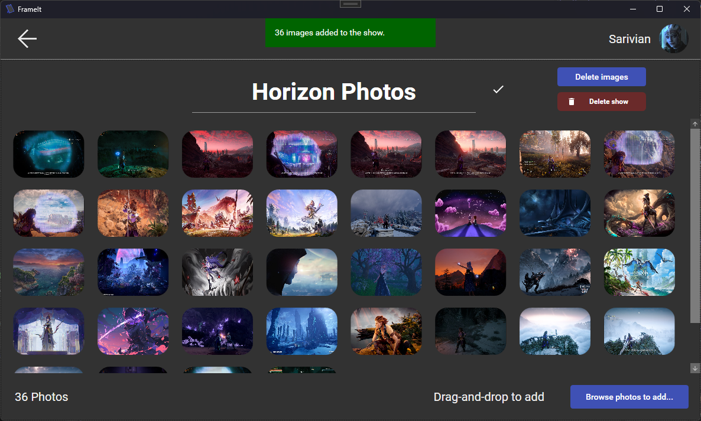
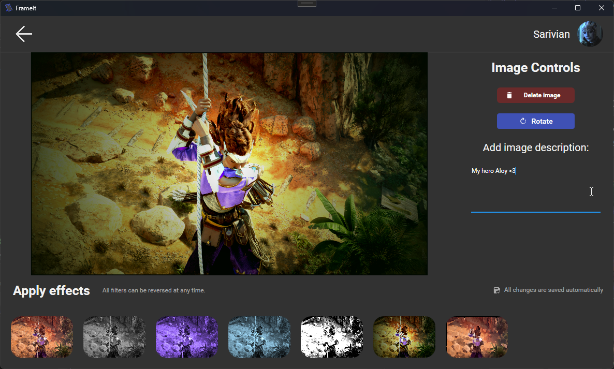
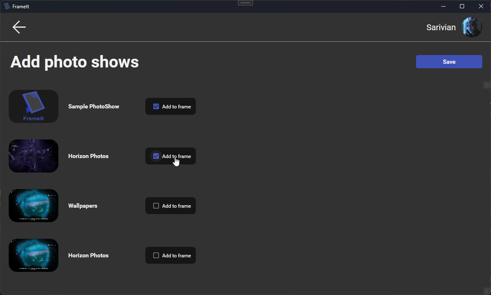
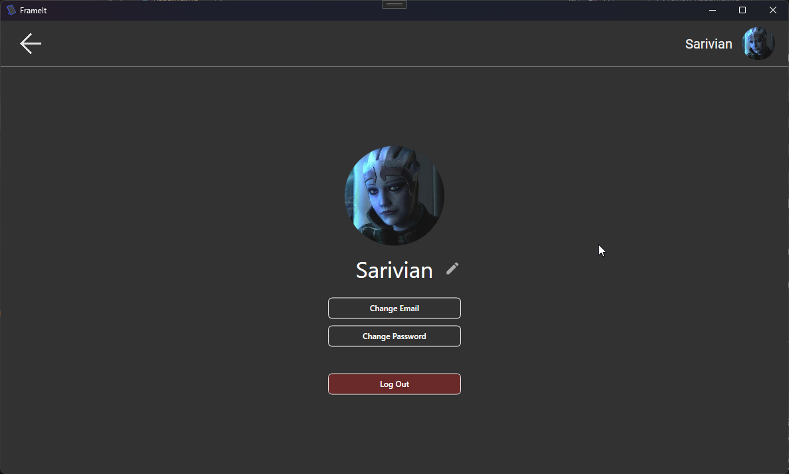
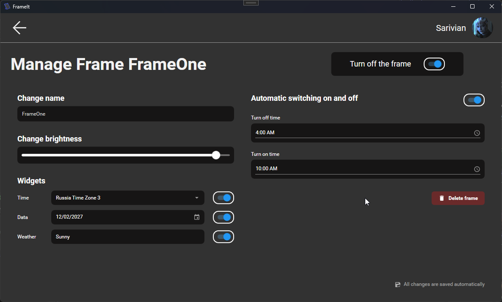

Manage all your frames at ease, in one place!

# About
FrameIt is a group **front-end only** project for an app that lets you manage your digital frames through flexible photo shows mechanic.

# Photo shows
The core functionality of FrameIt is the ability to create and manage photo shows. Those can have any amount of photos added from your device, and then further edited through easy-to-use built-in filters to highlight the stunning memories they carry.

# Frames
Each frame can have one or more photo shows added to it and will route through them automatically. Adding or removing shows from any of your frames is just one click away!

# Account-bound
Your account is your home. Whenever you add a new frame to your account, you can transfer all your existing shows and photos to it instantly.

# For both individual and business
Each of your frames can be managed online, through what you can:
- Turn it on / off, incl at specified time intervals
- Manage brightness
- Add and configure widgets such as weather or date & time

For example, you can easily use FrameIt to set up your business frames to display various sequential information to clients!

# Build
Built with Visual Studio 2026, C# 14, and .NET 10 with WPF interface & MaterialDesignTheme. All NuGets referenced. Supports Windows only.